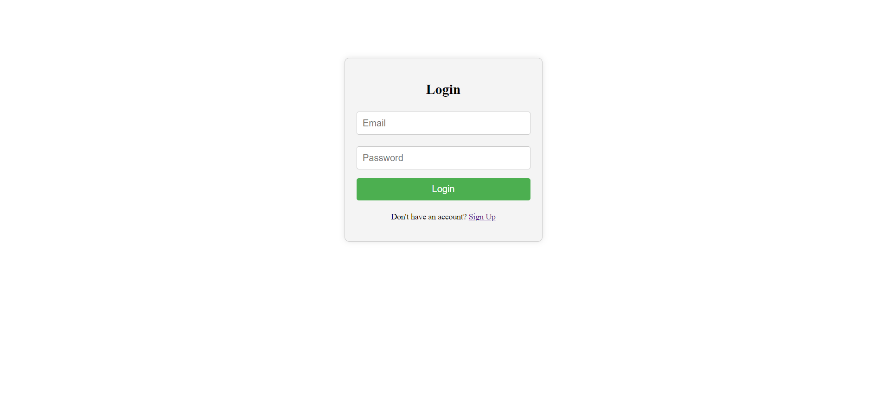
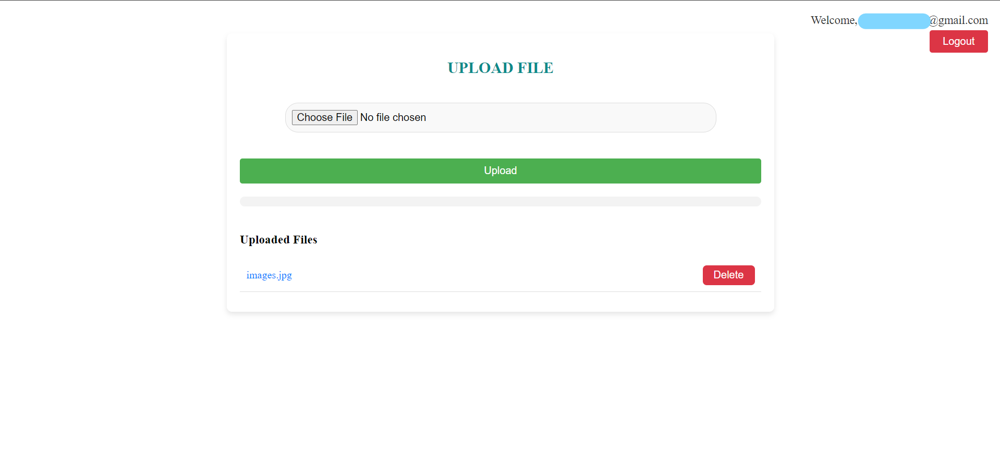

# FileHive

A simple web application for uploading, storing, and managing files, similar to Google Drive. The application uses React for the frontend and Firebase for authentication and storage.

## Features

- User authentication (sign up, login, logout) using Firebase Authentication
- Upload files to Firebase Storage
- Display a list of uploaded files with the ability to delete files
- Responsive design with CSS
- Session management to ensure only logged-in users can access the upload page
- Error handling for failed authentication

## Technologies Used

- React.js
- Firebase (Authentication and Storage)
- React Router
- HTML/CSS

## Getting Started

### Prerequisites

Before you begin, ensure you have the following installed:

- [Node.js](https://nodejs.org/) (version 14 or later)
- [npm](https://www.npmjs.com/get-npm)
- A Firebase project set up with Firebase Authentication and Firebase Storage

### Installation

1. Clone the repository:

   ```bash
   git clone https://github.com/your-username/filehive.git
   ```

2. Navigate to the project directory:

   ```bash
   cd filehive
   ```

3. Install the dependencies:

   ```bash
   npm install
   ```

4. Set up Firebase:

   - Create a Firebase project in the [Firebase Console](https://console.firebase.google.com/).
   - Enable Email/Password authentication under the Authentication section.
   - Set up Firebase Storage in your project.
   - Create a `.env` file in the root of your project and add your Firebase configuration:

   ```env
   REACT_APP_FIREBASE_API_KEY=your_api_key
   REACT_APP_FIREBASE_AUTH_DOMAIN=your_auth_domain
   REACT_APP_FIREBASE_PROJECT_ID=your_project_id
   REACT_APP_FIREBASE_STORAGE_BUCKET=your_storage_bucket
   REACT_APP_FIREBASE_MESSAGING_SENDER_ID=your_messaging_sender_id
   REACT_APP_FIREBASE_APP_ID=your_app_id
   ```

5. Start the development server:

   ```bash
   npm start
   ```

6. Open your browser and navigate to `http://localhost:3000` to view the application.

## Project Structure

```plaintext
filehive/
├── public/
├── src/
│   ├── components/
│   │   ├── Login.js
│   │   ├── SignUp.js
│   │   ├── Upload.js
│   │   ├── SessionManager.js
│   │   └── firebase.js
│   ├── App.js
│   ├── index.js
│   ├── App.css
│   ├── Login.css
│   └── Upload.css
├── .env
├── .gitignore
├── package.json
└── README.md
```

## Firebase Configuration

Create a `firebase.js` file in the `src` directory and add the following code:

```javascript
import { initializeApp } from 'firebase/app';
import { getAuth } from 'firebase/auth';
import { getStorage } from 'firebase/storage';

const firebaseConfig = {
  apiKey: process.env.REACT_APP_FIREBASE_API_KEY,
  authDomain: process.env.REACT_APP_FIREBASE_AUTH_DOMAIN,
  projectId: process.env.REACT_APP_FIREBASE_PROJECT_ID,
  storageBucket: process.env.REACT_APP_FIREBASE_STORAGE_BUCKET,
  messagingSenderId: process.env.REACT_APP_FIREBASE_MESSAGING_SENDER_ID,
  appId: process.env.REACT_APP_FIREBASE_APP_ID
};

const app = initializeApp(firebaseConfig);
export const auth = getAuth(app);
export const storage = getStorage(app);
```

## Usage

1. **Sign Up**: Create a new account by providing an email and password on the sign-up page.
2. **Login**: Log in with your credentials.
3. **Upload Files**: Upload files and view the list of uploaded files on the upload page.
4. **Delete Files**: Remove files from storage by clicking the delete button next to each file.
5. **Logout**: Log out from the application.

## Screenshots

### Login Page



### Upload Page


## Contributing

Feel free to contribute to this project by creating pull requests, submitting issues, or suggesting new features.

## Acknowledgements

- [Firebase](https://firebase.google.com/) for providing authentication and storage services.
- [React](https://reactjs.org/) for the frontend framework.
```

### Steps to Use

1. **Replace placeholders**: Replace the placeholder text (e.g., `your_api_key`, `your-username`, `your-image-url.com`) with your actual information.
2. **Push to GitHub**: Commit your changes and push the repository to GitHub.

This `README.md` file should serve as a comprehensive guide for anyone looking to understand, set up, and run your project.
